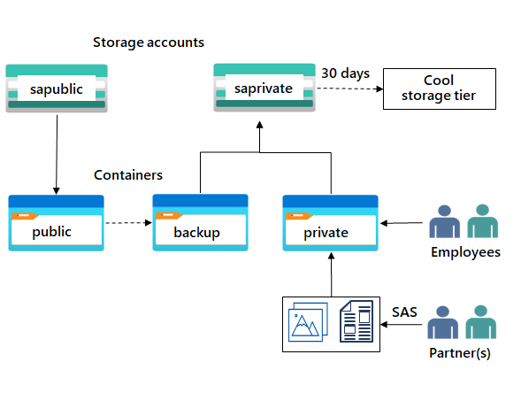

---
lab:
  title: 'Exercício 02b: fornecer armazenamento privado para documentos internos da empresa'
  module: Guided Project - Azure Files and Azure Blobs
---

A empresa precisa de armazenamento para os escritórios e os departamentos. Esse conteúdo é particular da empresa e não deve ser compartilhado sem consentimento. Esse armazenamento exige alta disponibilidade em caso de interrupção regional. A empresa deseja usar esse armazenamento para fazer backup do site público. 

## Diagrama de arquitetura

## Tarefas de habilidades
- Criar uma conta de armazenamento para os documentos particulares da empresa.
- Configurar a redundância para a conta de armazenamento. 
- Configurar uma assinatura de acesso compartilhado para que os parceiros tenham acesso restrito a um arquivo. 
- Faça backup do armazenamento do site público.
- Implemente o gerenciamento do ciclo de vida para mover o conteúdo para a camada fria.

## Instruções para o exercício

> **Observação**: estas instruções exigem que você tenha concluído o **Lab 02a**, Fornecer armazenamento para documentos internos.

## Criar uma conta de armazenamento e configurar alta disponibilidade.

1. Crie uma conta de armazenamento para os documentos internos particulares da empresa.
    - No portal do Azure, procure e selecione **Contas de armazenamento**.  
    - Selecione **+ Criar**. 
    - Selecione o **Grupo de recursos** criado no laboratório anterior.   
    - Defina o **Nome da conta de armazenamento** como `private`. Adicione um identificador ao nome para garantir que o nome seja exclusivo. 
    - Selecione **Revisar** e **crie** a conta de armazenamento. 
    - Aguarde até a conta de armazenamento ser implantada e selecione **Ir para o recurso**.

1. Esse armazenamento exige alta disponibilidade em caso de interrupção regional. O acesso de leitura em uma região secundária não é necessário. Configure o nível apropriado de **redundância**. 

    - Na conta de armazenamento, na seção **Gerenciamento de dados**, selecione a folha **Redundância**. 
    - Verifique se a opção **GRS (armazenamento com redundância geográfica)** está selecionada.
    - **Atualize** a página. 
    - Revise as informações de localização primária e secundária. 
    - **Salve** suas alterações.

## Criar um contêiner de armazemaneto, carregar um arquivo e restringir o acesso ao arquivo. 

1. Crie um contêiner de armazenamento privado para os dados corporativos. 

    - Na conta de armazenamento, na seção **Armazenamento de Dados**, selecione a folha **Contêineres**. 
    - Selecionar **+ Contêiner**. 
    - Verifique se o **Nome** do contêiner é `private`.
    - Verifique se o **Nível de acesso público** é **Privado (sem acesso anônimo)**.
    - Se tiver tempo, revise as Configurações **avançadas**, mas siga os padrões. 
    - Selecione **Criar**. 

1.  Para teste, carregue um arquivo no contêiner **privado**. O tipo de arquivo não importa. Uma imagem ou um arquivo de texto pequeno é uma boa opção. Faça o teste para verificar se o arquivo não pode ser acessado publicamente. 

    - Selecione o novo contêiner.
    - Escolha **Carregar**.
    - **Navegue até arquivos** e selecione um arquivo.
    - **Carregue** o arquivo.
    - Selecione o arquivo carregado.
    - Na guia **Visão geral**, copie a **URL**.
    - Cole a **URL** em uma nova guia do navegador. 
    - Verifique se o arquivo não é exibido e você recebe um erro. 

1. Um parceiro externo exige acesso de leitura e gravação no arquivo, pelo menos, nas próximas 24 horas. Configure e teste uma SAS (assinatura de acesso compartilhado). Saiba mais sobre as [Assinaturas de Acesso Compartilhado](https://learn.microsoft.com/azure/storage/common/storage-sas-overview).

    - Selecione o arquivo de blob carregado e vá para a guia **Gerar SAS**. 
    - Na lista suspensa **Permissões**, verifique se o parceiro tem apenas permissões de **Leitura**.
    - Verifique se a **Data/hora de início e validade** está definida como as próximas 24 horas. 
    - Selecione **Gerar token SAS e URL**.
    - Copie a **URL SAS do Blob** para uma nova guia do navegador.
    - Verifique se você consegue acessar o arquivo. Se você carregou um arquivo de imagem, ele será exibido no navegador. Outros tipos de arquivo serão baixados.

## Configurar camadas de acesso de armazenamento e replicação de conteúdo.

1. Para economizar nos custos, após 30 dias, mova os blobs da camada frequente para a camada esporádica. Saiba mais sobre como gerenciar o [ciclo de vida de armazenamento de Blobs do Azure](https://learn.microsoft.com/azure/storage/blobs/lifecycle-management-policy-configure?tabs=azure-portal).

    - Volte para a **conta de armazenamento**.
    - Na seção **Visão geral**, observe que a **Camada de acesso padrão ** está definida como **Frequente**. 
    - Na seção **Gerenciamento de dados**, selecione a folha **Gerenciamento do ciclo de vida**.
    - Selecione **Adicionar regra**. 
    - Defina o **Nome da regra** como `movetocool`.
    - Defina o **Escopo da regra** como **Aplicar regra a todos os blobs na conta de armazenamento**.
    - Selecione **Avançar**.
    - Verifique se a opção **Data da última modificação** está selecionada.
    - Defina **Mais de (dias atrás)** como **30**.
    - Na lista suspensa **Em seguida**, selecione **Mover para o armazenamento frio**.
    - Se tiver tempo, analise outras opções de ciclo de vida na lista suspensa. 
    - **Adicione** a regra.
  
1. Os arquivos do site público precisam ser copiados em backup para outra conta de armazenamento. [Saiba mais sobre [replicação de objeto](https://learn.microsoft.com/azure/storage/blobs/object-replication-configure?tabs=portal).

    - Na conta de armazenamento, **crie** um novo contêiner chamado `backup`. Use os valores padrão. Consulte novamente o Lab 02a se precisar de instruções detalhadas. 
    - Navegue até a conta de armazenamento **publicwebsite**. Essa conta de armazenamento foi criada no exercício anterior. 
        - Na seção **Gerenciamento de dados**, selecione a folha **Replicação de objeto**. 
        - Selecione **Criar regras de replicação**.
        - Defina a **conta de armazenamento de destino** como a conta de armazenamento  **privado**.
        - Defina o **Contêiner de origem** como **público** e o **Contêiner de destino** como **backup**.
        - **Crie** a regra de replicação. 
    - Opcionalmente, se você tiver tempo, carregue um arquivo no contêiner **público**. Retorne à conta de armazenamento **privado** e atualize o contêiner de **backup**. Dentro de alguns minutos, o arquivo do site público aparecerá na pasta de backup. 

>**Observação**: para ter uma prática adicional, conclua o módulo [Configurar o armazenamento de blobs do Azure](https://learn.microsoft.com/training/modules/configure-blob-storage/). O módulo tem uma simulação de laboratório interativa na qual você pode obter mais prática na criação de um armazenamento de blobs. 

## Estender seu aprendizado com o Copilot

O Copilot pode ajudar você em sua jornada de aprendizado. O Copilot pode oferecer informações técnicas básicas, etapas de alto nível, prós e contras, ajuda para solução de problemas, casos de uso, exemplos de codificação e muito mais. Para acessar o Copilot, abra um navegador Edge e escolha Copilot (canto superior direito). Reserve alguns minutos para experimentar essas solicitações.
+ Quais recursos de segurança estão disponíveis para proteger o armazenamento do Azure?
+ O que é uma SAS do Azure e como ela é usada?

## Saiba mais com treinamento individual

+ [Configure a segurança do Armazenamento do Azure](https://learn.microsoft.com/training/modules/configure-storage-security/). Neste módulo, você verá como configurar recursos comuns de segurança do Armazenamento do Azure, como assinaturas de acesso de armazenamento.
+ [Gerencie o ciclo de vida do Armazenamento de Blobs do Azure](https://learn.microsoft.com/training/modules/configure-storage-security/). Neste módulo, você verá como gerenciar a disponibilidade de dados em todo o ciclo de vida do Armazenamento de Blobs do Azure.

## Principais aspectos a serem lembrados

Parabéns por concluir o laboratório. Aqui estão as principais lições desse laboratório. 
+ O armazenamento do Azure tem muitos recursos de proteção de dados, incluindo: criptografia, controle de acesso, segurança de rede, monitoramento e alertas. 
+ Uma assinatura de acesso compartilhado (SAS) fornece acesso delegado protegido aos recursos da sua conta de armazenamento. Com uma SAS, você tem controle granular sobre como um cliente pode acessar seus dados.
+ O gerenciamento do ciclo de vida do Armazenamento de Blobs do Azure oferece uma política baseada em regras que é possível usar para fazer a transição dos seus dados de blob para as camadas de acesso apropriadas e para expirar os dados no final do seu ciclo de vida.
+ A replicação de objeto copia de maneira assíncrona os blob de blocos entre uma conta de armazenamento de origem e uma conta de destino.
