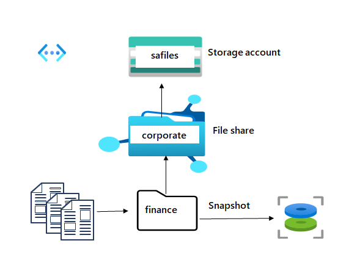

---
lab:
  title: 'Exercício 03: fornecer armazenamento de arquivos compartilhado para os escritórios da empresa'
  module: Guided Project - Azure Files and Azure Blobs
---

A empresa está geograficamente dispersa, com escritórios em diferentes localidades.  Esses escritórios precisam de uma forma de compartilhar arquivos e disseminar informações. Por exemplo, o departamento financeiro precisa confirmar as informações de custo para auditoria e conformidade. Esses compartilhamentos de arquivos devem ser fáceis de acessar e carregar sem demora. Alguns conteúdos só devem ser acessados de redes virtuais corporativas selecionadas.

## Diagrama de arquitetura

## Tarefas de habilidades
- Crie uma conta de armazenamento especificamente para compartilhamentos de arquivos. 
- Configure um compartilhamento de arquivos e um diretório.  
- Configure instantâneos e pratique a restauração de arquivos. 
- Restrinja o acesso a uma rede virtual e sub-rede específicas. 

## Instruções para o exercício

>**Observação**: para concluir este laboratório, você precisará de uma [assinatura do Azure](https://azure.microsoft.com/free/).

## Criar e configurar uma conta de armazenamento para Arquivos do Azure. 

1. Crie uma conta de armazenamento para os arquivos compartilhados do departamento financeiro.  Saiba mais sobre as contas de armazenamento para [implantações de Arquivos do Azure](https://learn.microsoft.com/azure/storage/files/storage-files-planning#management-concepts).

    - No portal, pesquise e selecione `Storage accounts`.
    - Selecione **+ Criar**.
    - Em **Grupo de recursos**, selecione **Criar novo**. Dê um **nome** ao grupo de recursos e selecione **OK** para salvar as alterações. 
    - Forneça um **Nome da conta de armazenamento**. Verifique se o nome atende aos requisitos de nomenclatura. 
    - Defina o **Desempenho** como **Premium**.
    - Defina o **Tipo de conta Premium** como **Compartilhamentos de arquivos**.
    - Defina a **Redundância** como **Armazenamento com redundância de zona**.
    - Selecione **Revisar** e **Criar** a conta de armazenamento.
    - Aguarde até o recurso ser implantado.
    - Selecione **Ir para o recurso**. 

## Criar e configurar um compartilhamento de arquivo com um diretório.

1. Crie um compartilhamento de arquivos para o escritório corporativo. Saiba mais sobre as [camadas de Arquivos do Azure](https://learn.microsoft.com/azure/storage/files/storage-files-planning#storage-tiers).

    - Na conta de armazenamento, na seção **Armazenamento de dados**, selecione a folha **Compartilhamentos de arquivos**. 
    - Selecione **+ Compartilhamento de arquivos** e forneça um **Nome**.
    - Revise as outras opções, mas siga os padrões.
    - Escolha **Criar**

1. Adicione um diretório ao compartilhamento de arquivos para o departamento financeiro. Para testes futuros, carregue um arquivo. 

    - Selecione o seu compartilhamento de arquivos e clique em **+ Adicionar diretório**. 
    - Nomeie o novo diretório `finance`.
    - Selecione **Procurar** e, em seguida, selecione o diretório **financeiro** .
    - Observe que você pode **Adicionar diretório** para organizar ainda mais seu compartilhamento de arquivos.
    - **Carregue** um arquivo de sua escolha. 

## Configurar e testar instantâneos.

1. De modo semelhante ao armazenamento de blobs, você precisa protegê-lo contra a exclusão acidental de arquivos. Você decide usar instantâneos. Saiba mais sobre [instantâneos de arquivos](https://learn.microsoft.com/azure/storage/files/storage-snapshots-files).
    
    - Selecione o seu compartilhamento de arquivo.
    - Na seção **Operações**, selecione a folha **Instantâneos**. 
    - Selecione **+ Adicionar instantâneo**. O comentário é opcional. Selecione **OK**.
    - Selecione seu instantâneo e verifique se o diretório de arquivos e o arquivo carregado estão incluídos.
  
1. Pratique o uso de instantâneos para restaurar um arquivo.
    - Retorne para o seu **compartilhamento de arquivo**.
    - **Navegue** até o diretório de arquivos. 
    - Localize o arquivo carregado e, no painel **Propriedades**, selecione **Excluir**. Selecione **Sim** para confirmar a exclusão. 
    - Selecione a folha **Instantâneos** e selecione o seu instantâneo. 
    - Procure o arquivo que deseja carregar.
    - Selecione o arquivo e, em seguida, selecione **Restaurar**.
    - Forneça um **Nome de arquivo restaurado**. 
    - Verifique se o diretório de arquivos tem o arquivo restaurado.  

## Configure a restrição de acesso ao armazenamento a redes virtuais selecionadas.

1. Essas tarefas nesta seção exigem uma rede virtual com sub-rede. Em um ambiente de produção, esses recursos já estariam criados.
    - Pesquise por **Redes virtuais** e selecione essa opção.
        - Selecione **Criar**. Selecione o grupo de recursos. e dê um **nome** à rede virtual.
        - Assuma os padrões para outros parâmetros, selecione **Revisar + criar** e, em seguida, **Criar**.
        - Aguarde até o recurso ser implantado.
        - Selecione **Ir para o recurso**. 
    - Na seção **Configurações**, selecione a folha **Sub-redes**.
        - Selecione a sub-rede **padrão**.
        - Na seção **Pontos de extremidade de serviço**, escolha **Microsoft.Storage** na lista suspensa **Serviços**.
        - Não faça nenhuma outra alteração.    
        - Não se esqueça de **Salvar** suas alterações. 
   
1. A conta de armazenamento só deve ser acessada a partir da rede virtual que você acabou de criar. Saiba mais sobre como usar [pontos de extremidade privados](https://learn.microsoft.com/azure/storage/common/storage-private-endpoints).

    - Volte à sua **conta de armazenamento de arquivos**. 
    - Na seção **Segurança + rede**, selecione a folha **Rede**.
        - Altere o **Acesso à rede pública** para **Habilitado em redes virtuais e endereços IP selecionados**.
        - Na seção **Redes virtuais**, selecione **Adicionar rede virtual existente**.
        - Selecione a sua rede virtual e sub-rede e selecione **Adicionar**.
        - Não se esqueça de **Salvar** suas alterações. 
    - Selecione o **Navegador de armazenamento** e navegue até o compartilhamento de arquivos. 
    - Verifique a mensagem *Não autorizado a executar esta operação*. Você não está se conectando da rede virtual. 

>**Observação**: para ter uma prática adicional, conclua o módulo [Configurar a segurança do armazenamento do Azure](https://learn.microsoft.com/training/modules/configure-storage-security/). O módulo tem uma simulação de laboratório interativa na qual você pode obter mais prática na criação de um armazenamento seguro. 

## Estender seu aprendizado com o Copilot

O Copilot pode ajudar você em sua jornada de aprendizado. O Copilot pode oferecer informações técnicas básicas, etapas de alto nível, prós e contras, ajuda para solução de problemas, casos de uso, exemplos de codificação e muito mais. Para acessar o Copilot, abra um navegador Edge e escolha Copilot (canto superior direito). Reserve alguns minutos para experimentar essas solicitações.
+ O que é o armazenamento de arquivos do Azure e como ele é diferente do armazenamento de Blobs do Azure? Como decidir qual deles usar?
+ Quais são as diferentes maneiras de proteger o conteúdo do arquivo do Azure?

## Saiba mais com treinamento individual

+ [Configure os Arquivos do Azure e a Sincronização de Arquivos do Azure](https://learn.microsoft.com/en-us/training/modules/configure-azure-files-file-sync/). Neste módulo, você verá como configurar compartilhamentos de arquivos do Azure e instantâneos de compartilhamento de arquivos.

## Principais aspectos a serem lembrados

Parabéns por concluir o laboratório. Aqui estão as principais lições desse laboratório. 
+ Os Arquivos do Azure oferecem compartilhamentos de arquivos totalmente gerenciados na nuvem que são acessíveis por meio do protocolo SMB, do protocolo NFS (Network File System) e da API REST dos Arquivos do Azure padrão do setor.
+ Os Arquivos do Azure fornecem a funcionalidade de realizar instantâneos de compartilhamentos de arquivos SMB e NFS. Os instantâneos de compartilhamento capturam o estado de compartilhamento naquele ponto no tempo. Compartilhamentos de instantâneos fornecem apenas a proteção no nível de arquivo.
+ Você pode configurar um ponto de extremidade da conta de armazenamento para acessar o compartilhamento de arquivos do Azure diretamente. Os pontos de extremidade restringem o acesso à rede para sua conta de armazenamento.

